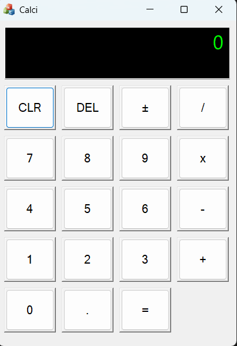

# MFC Calculator 🧮

This project is a simple **Calculator application built using MFC (Microsoft Foundation Classes)** in Visual Studio.  
It’s part of my learning process where I explored how to build Windows desktop apps using MFC, resource files, and event handling.

---

## 🚀 Learning Journey

I built this calculator step by step while learning MFC:

1. **Creating the Project**  
   - Started with a `Dialog-based` MFC project (`CMFCApplication1`).  
   - Learned how `.rc` files and resources (buttons, edit boxes) connect to C++ code.  

2. **Designing the UI**  
   - Added an **Edit Control** (`IDC_EDIT_DISPLAY`) to serve as the calculator display.  
   - Created buttons (`0–9`, `+`, `-`, `*`, `/`, `=`, `C`) in the dialog editor.  

3. **Customizing the Display**  
   - Used `OnCtlColor` to style the display:  
     - Black background  
     - Green text (digital calculator look)  
   - Made the display read-only and right-aligned.  

4. **Handling Events**  
   - Connected button clicks to event handlers (`ON_BN_CLICKED`).  
   - Implemented logic for numbers, operations, and `=` evaluation.  

5. **Responsiveness**  
   - Used `OnSize` to make the calculator layout **resize dynamically**.  
   - Learned about handling `WM_SIZE` safely to avoid crashes.  

6. **Building a Portable EXE**  
   - Switched project settings to **static linking** (`/MT` and static MFC).  
   - Now the `.exe` runs standalone without requiring Visual C++ Redistributable.  

---

## 🖼️ Screenshots

### Main Calculator UI

### Digital Display Styling

---

## 📝 What I Learned
- Basics of MFC dialogs and resources.  
- Handling Windows messages (`WM_SIZE`, `WM_CTLCOLOR`).  
- Using `GetDlgItem` and `MoveWindow` for dynamic layouts.  
- Linking MFC statically to make portable `.exe`.  
- Git basics (commits, pushes, handling upstream branches).  

---

## ⚡ How to Build
1. Open the `.sln` file in **Visual Studio**.  
2. Set configuration to **Release**.  
3. Build solution (`Ctrl+Shift+B`).  
4. Run `x64/Release/MFCApplication1.exe`.  

---

## 🙌 Future Improvements
- Add keyboard input support.  
- Add more operations (%, sqrt, memory).  
- Make modern flat-style buttons.  

---

